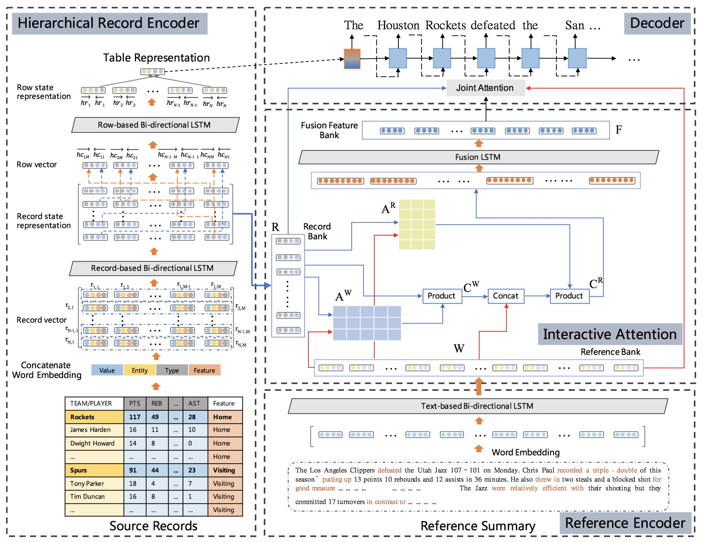

# SCIR-TG-Data2text-Bi-Aspect
This repo contains document-level code for [Learning to Select Bi-Aspect Information for Document-Scale Text Content Manipulation](https://arxiv.org/abs/2002.10210); this code is based on an earlier release of [OpenNMT-py](https://github.com/OpenNMT/OpenNMT-py). The Pytorch version is 0.4.1.

The sentence-level code for Learning to Select Bi-Aspect Information for Document-Scale Text Content Manipulation is in https://github.com/syw1996/SCIR-TG-Data2text-TCM.

## Architecture
